# setting up

user root

```
cgdelete -g memory,cpu:groupname/cpulimited_simha

cgcreate -g memory,cpu:groupname/cpulimited_simha

cd /sys/fs/cgroup/memory/groupname/

total 0
drwxr-xr-x 3 root root 0 May 28 11:02 .
dr-xr-xr-x 7 root root 0 May 16 12:11 ..
-rw-r--r-- 1 root root 0 May 28 11:04 cgroup.clone_children
--w--w--w- 1 root root 0 May 28 11:04 cgroup.event_control
-rw-r--r-- 1 root root 0 May 28 11:04 cgroup.procs
drwxr-xr-x 2 root root 0 May 28 11:04 cpulimited_simha
-rw-r--r-- 1 root root 0 May 28 11:04 memory.failcnt
--w------- 1 root root 0 May 28 11:04 memory.force_empty
-rw-r--r-- 1 root root 0 May 28 11:04 memory.kmem.failcnt
-rw-r--r-- 1 root root 0 May 28 11:04 memory.kmem.limit_in_bytes
-rw-r--r-- 1 root root 0 May 28 11:04 memory.kmem.max_usage_in_bytes
-r--r--r-- 1 root root 0 May 28 11:04 memory.kmem.slabinfo
-rw-r--r-- 1 root root 0 May 28 11:04 memory.kmem.tcp.failcnt
-rw-r--r-- 1 root root 0 May 28 11:04 memory.kmem.tcp.limit_in_bytes
-rw-r--r-- 1 root root 0 May 28 11:04 memory.kmem.tcp.max_usage_in_bytes
-r--r--r-- 1 root root 0 May 28 11:04 memory.kmem.tcp.usage_in_bytes
-r--r--r-- 1 root root 0 May 28 11:04 memory.kmem.usage_in_bytes
-rw-r--r-- 1 root root 0 May 28 11:04 memory.limit_in_bytes
-rw-r--r-- 1 root root 0 May 28 11:04 memory.max_usage_in_bytes
-rw-r--r-- 1 root root 0 May 28 11:04 memory.memsw.failcnt
-rw-r--r-- 1 root root 0 May 28 11:04 memory.memsw.limit_in_bytes
-rw-r--r-- 1 root root 0 May 28 11:04 memory.memsw.max_usage_in_bytes
-r--r--r-- 1 root root 0 May 28 11:04 memory.memsw.usage_in_bytes
-rw-r--r-- 1 root root 0 May 28 11:04 memory.move_charge_at_immigrate
-r--r--r-- 1 root root 0 May 28 11:04 memory.numa_stat
-rw-r--r-- 1 root root 0 May 28 11:04 memory.oom_control
---------- 1 root root 0 May 28 11:04 memory.pressure_level
-rw-r--r-- 1 root root 0 May 28 11:04 memory.soft_limit_in_bytes
-r--r--r-- 1 root root 0 May 28 11:04 memory.stat
-rw-r--r-- 1 root root 0 May 28 11:04 memory.swappiness
-r--r--r-- 1 root root 0 May 28 11:04 memory.usage_in_bytes
-rw-r--r-- 1 root root 0 May 28 11:04 memory.use_hierarchy
-rw-r--r-- 1 root root 0 May 28 11:04 notify_on_release
-rw-r--r-- 1 root root 0 May 28 11:03 tasks

```

# My configuration of cgroups: 

after experimenting with pdf-crop-margins large documents with large page sises (6" x 22") and want to crop the white margins.

Also for chromium use great suspender


```bash

Finding the binding box is very fast here 
8GB memory out of 12GB and (5)/1024 = 0.5% of cpu
echo $(( 8 * 1024 * 1024 * 1024 )) > /sys/fs/cgroup/memory/groupname/cpulimited_simha/memory.limit_in_bytes
echo 5 > /sys/fs/cgroup/cpu/groupname/cpulimited_simha/cpu.shares


THIS IS THE BEST (.ppm files are made veryfast) (but slight throttling for other applications)
2GB memory out of 12GB and (10)/1024 = 1% of cpu

echo $(( 2 * 1024 * 1024 * 1024 )) > /sys/fs/cgroup/memory/groupname/cpulimited_simha/memory.limit_in_bytes
echo 10 > /sys/fs/cgroup/cpu/groupname/cpulimited_simha/cpu.shares

VERY GOOD (little Throttling in .ppm)
200MB memory out of 12GB and (10)/1024 = 1% of cpu

echo $(( 200 * 1024 * 1024 )) > /sys/fs/cgroup/memory/groupname/cpulimited_simha/memory.limit_in_bytes
echo 10 > /sys/fs/cgroup/cpu/groupname/cpulimited_simha/cpu.shares

GOOD
100MB memory out of 12GB and (50)/1024 = 5% of cpu

echo $(( 100 * 1024 * 1024 )) > /sys/fs/cgroup/memory/groupname/cpulimited_simha/memory.limit_in_bytes
echo 50 > /sys/fs/cgroup/cpu/groupname/cpulimited_simha/cpu.shares

VERY SLOW

10MB memory out of 12GB and (100)/1024 = 10% of cpu
echo $(( 10 * 1024 * 1024 )) > /sys/fs/cgroup/memory/groupname/cpulimited_simha/memory.limit_in_bytes
echo 100 > /sys/fs/cgroup/cpu/groupname/cpulimited_simha/cpu.shares

Best (but freezes slighty others)

echo $(( 100 * 1024 * 1024 )) > /sys/fs/cgroup/memory/groupname/cpulimited_simha/memory.limit_in_bytes
echo 100 > /sys/fs/cgroup/cpu/groupname/cpulimited_simha/cpu.shares

THIS  ALSO freezing a bit

echo $(( 2 * 1024 * 1024 * 1024 )) > /sys/fs/cgroup/memory/groupname/cpulimited_simha/memory.limit_in_bytes
echo 100 > /sys/fs/cgroup/cpu/groupname/cpulimited_simha/cpu.shares

THE BELOW IS freezing the cpu (dont use)

echo $(( 4 * 1024 * 1024 * 1024 )) > /sys/fs/cgroup/memory/groupname/cpulimited_simha/memory.limit_in_bytes
echo 300 > /sys/fs/cgroup/cpu/groupname/cpulimited_simha/cpu.shares
```

Conclusion for long running processes give less memory. and less cpu else bursting happens and freezes

Here pdf-crop-margins is a long running process

`taskset -c 0 with pdf-crop-margins freezing the cpu.` 

So use only cgroups

# DISPLAYING PARAMETERS OF CONTROL GROUPS

```bash
cgget -g cpu,memory:/groupname/cpulimited_simha
/groupname/cpulimited_simha:
cpu.cfs_period_us: 100000
cpu.stat: nr_periods 0
	nr_throttled 0
	throttled_time 0
cpu.shares: 1024
cpu.cfs_quota_us: -1
memory.use_hierarchy: 1
memory.kmem.tcp.usage_in_bytes: 0
memory.soft_limit_in_bytes: 9223372036854771712
memory.move_charge_at_immigrate: 0
memory.memsw.failcnt: 0
memory.kmem.tcp.max_usage_in_bytes: 0
memory.max_usage_in_bytes: 4162637824
memory.oom_control: oom_kill_disable 0
	under_oom 0
	oom_kill 13
memory.stat: cache 329420800
	rss 132247552
	rss_huge 0
	shmem 49152
	mapped_file 577536
	dirty 40960
	writeback 0
	swap 192512
	pgpgin 544860160
	pgpgout 544747407
	pgfault 296028675
	pgmajfault 283787
	inactive_anon 79319040
	active_anon 53190656
	inactive_file 299528192
	active_file 29986816
	unevictable 0
	hierarchical_memory_limit 9223372036854771712
	hierarchical_memsw_limit 9223372036854771712
	total_cache 329420800
	total_rss 132247552
	total_rss_huge 0
	total_shmem 49152
	total_mapped_file 577536
	total_dirty 40960
	total_writeback 0
	total_swap 192512
	total_pgpgin 544860160
	total_pgpgout 544747407
	total_pgfault 296028675
	total_pgmajfault 283787
	total_inactive_anon 79319040
	total_active_anon 53190656
	total_inactive_file 299528192
	total_active_file 29986816
	total_unevictable 0
memory.kmem.slabinfo: slabinfo - version: 2.1
	# name            <active_objs> <num_objs> <objsize> <objperslab> <pagesperslab> : tunables <limit> <batchcount> <sharedfactor> : slabdata <active_slabs> <num_slabs> <sharedavail>
	shmem_inode_cache     23    138    696   23    4 : tunables    0    0    0 : slabdata      6      6      0
	proc_inode_cache      96     96    664   24    4 : tunables    0    0    0 : slabdata      4      4      0
	signal_cache         120    120   1088   30    8 : tunables    0    0    0 : slabdata      4      4      0
	sighand_cache         60     60   2112   15    8 : tunables    0    0    0 : slabdata      4      4      0
	files_cache           92     92    704   23    4 : tunables    0    0    0 : slabdata      4      4      0
	task_delay_info      204    204     80   51    1 : tunables    0    0    0 : slabdata      4      4      0
	task_struct           16     16   7744    4    8 : tunables    0    0    0 : slabdata      4      4      0
	kmalloc-1k            64     64   1024   16    4 : tunables    0    0    0 : slabdata      4      4      0
	kmalloc-192           84     84    192   21    1 : tunables    0    0    0 : slabdata      4      4      0
	inode_cache          108    108    592   27    4 : tunables    0    0    0 : slabdata      4      4      0
	kmalloc-rcl-96       126    168     96   42    1 : tunables    0    0    0 : slabdata      4      4      0
	kmalloc-rcl-64       903   1024     64   64    1 : tunables    0    0    0 : slabdata     16     16      0
	anon_vma             224    322     88   46    1 : tunables    0    0    0 : slabdata      7      7      0
	anon_vma_chain       332    512     64   64    1 : tunables    0    0    0 : slabdata      8      8      0
	mm_struct            120    120   1088   30    8 : tunables    0    0    0 : slabdata      4      4      0
	buffer_head        74673  81354    104   39    1 : tunables    0    0    0 : slabdata   2086   2086      0
	ext4_inode_cache    1221   1599   1080   30    8 : tunables    0    0    0 : slabdata     56     56      0
	dentry              1564   1680    192   21    1 : tunables    0    0    0 : slabdata     80     80      0
	cred_jar             336    378    192   21    1 : tunables    0    0    0 : slabdata     18     18      0
	pid                  128    128    128   32    1 : tunables    0    0    0 : slabdata      4      4      0
	filp                  93    128    256   16    1 : tunables    0    0    0 : slabdata      8      8      0
memory.limit_in_bytes: 9223372036854771712
memory.swappiness: 60
memory.memsw.max_usage_in_bytes: 5191344128
memory.numa_stat: total=112799 N0=112799
	file=80448 N0=80448
	anon=32351 N0=32351
	unevictable=0 N0=0
	hierarchical_total=112799 N0=112799
	hierarchical_file=80448 N0=80448
	hierarchical_anon=32351 N0=32351
	hierarchical_unevictable=0 N0=0
memory.kmem.failcnt: 0
memory.kmem.max_usage_in_bytes: 103940096
memory.usage_in_bytes: 474181632
memory.memsw.limit_in_bytes: 9223372036854771712
memory.failcnt: 115873683
memory.kmem.tcp.failcnt: 0
memory.kmem.limit_in_bytes: 9223372036854771712
memory.memsw.usage_in_bytes: 474185728
memory.kmem.usage_in_bytes: 12156928
memory.kmem.tcp.limit_in_bytes: 9223372036854771712
```

## default values::

```bash
cpu.cfs_period_us: 100000
cpu.shares: 1024
cpu.cfs_quota_us: -1
memory.limit_in_bytes: 9223372036854771712
```

# get pid of a group

```bash
$ pgrep -f pdf-crop-margins
6883
```


## get the cgroups for a pid

```bash
$ cat /proc/6883/cgroup                      
12:perf_event:/
11:cpuset:/
10:freezer:/
9:hugetlb:/
8:pids:/user.slice/user-1000.slice/session-2.scope
7:blkio:/user.slice
6:rdma:/
5:net_cls,net_prio:/
4:cpu,cpuacct:/groupname/cpulimited_simha
3:devices:/user.slice
2:memory:/groupname/cpulimited_simha
1:name=systemd:/user.slice/user-1000.slice/session-2.scope
0::/user.slice/user-1000.slice/session-2.scope
```

## How to assign a group to a pid

```bash
$ cgclassify -g memory,cpu:groupname/cpulimited_simha 6883
```

## Settings default values

```bash
echo -1 > /sys/fs/cgroup/memory/groupname/cpulimited_simha/memory.limit_in_bytes
echo 1024 > /sys/fs/cgroup/cpu/groupname/cpulimited_simha/cpu.shares
```

## Setting custom values

2GB memory and 10/1024 share:

```bash
echo $(( 2000 * 1024 * 1024 )) > /sys/fs/cgroup/memory/groupname/cpulimited_simha/memory.limit_in_bytes
echo 10 > /sys/fs/cgroup/cpu/groupname/cpulimited_simha/cpu.shares
```

good for pdf-crop-margins: 200MB memory and 10/1024 cpu

```bash
echo $(( 200 * 1024 * 1024 )) > /sys/fs/cgroup/memory/groupname/cpulimited_simha/memory.limit_in_bytes 
echo 10 > /sys/fs/cgroup/cpu/groupname/cpulimited_simha/cpu.shares  
```

# what is lower latency means

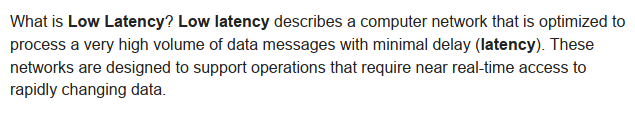

# CGROUPS understanding

https://engineering.indeedblog.com/blog/2019/12/unthrottled-fixing-cpu-limits-in-the-cloud/

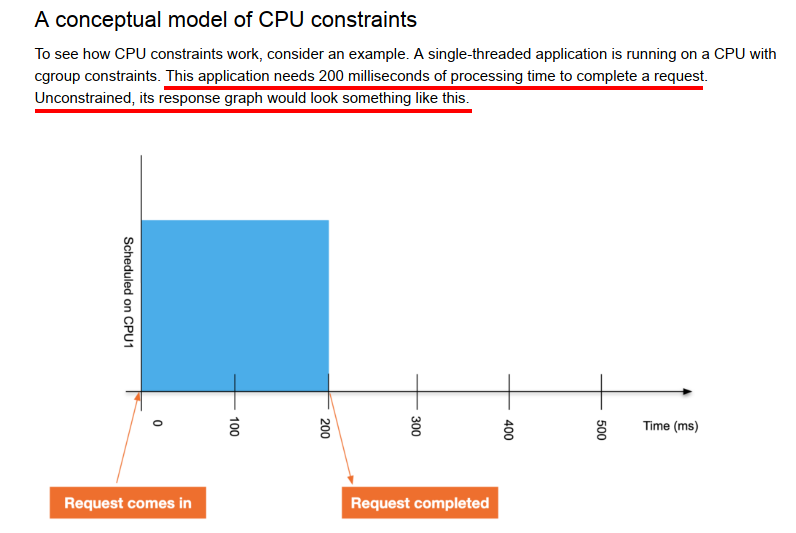

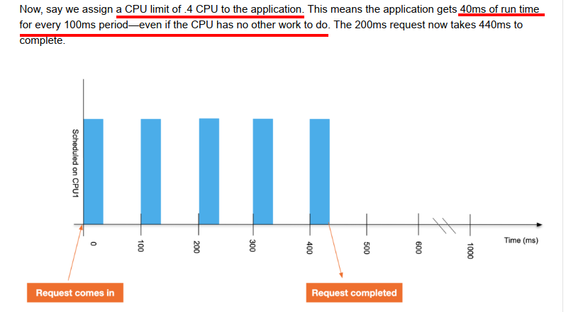

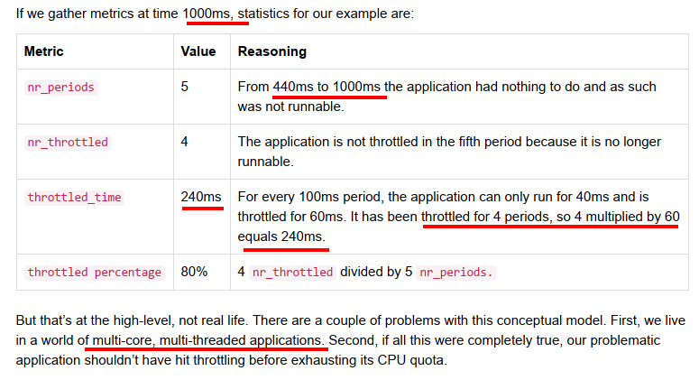

# Archlinux example

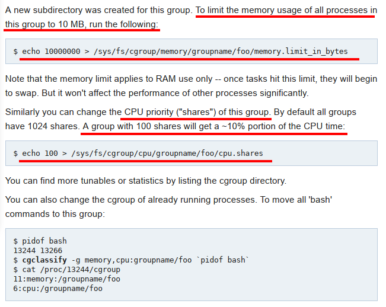

# cpu.shares

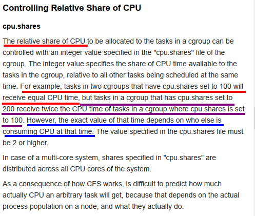


# Controlling CPU Throttling

## "noisy neighbor" problem

> "noisy neighbor" problem - processes that consume as much CPU as they can get, reducing everyone else's share.

## cpu.cfs_period_us

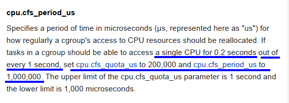

## cpu.cfs_quota_us

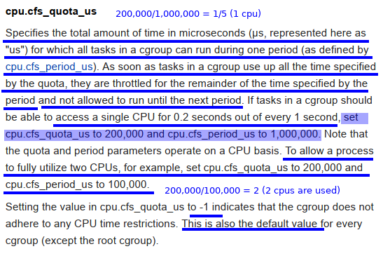

## cpu.stat

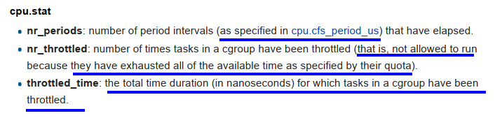

## cgroups question using differen intervals (small and big)

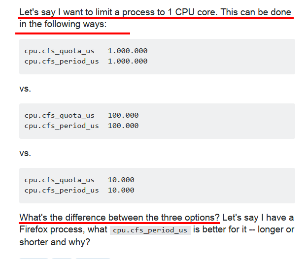

## Answer

>Every process gets a turn, soon. However there is more re-scheduling overhead: Every time the time runs out, and there are other processes ready to run, there is a re-schedule.

>Re-scheduling involves saving all registers on the stack, saving the stack-pointer into the task-control-block, switching task-control-block, disabling/enabling parts of the virtual-page-table, reloading the stack-pointer, and restoring the registers. It can also cause more cache misses. So in short things run slower.

>For long-running non-interactive tasks a longer scheduler period is better.


# cgroups: examples

https://01.org/linuxgraphics/gfx-docs/drm/scheduler/sched-bwc.html

## definition

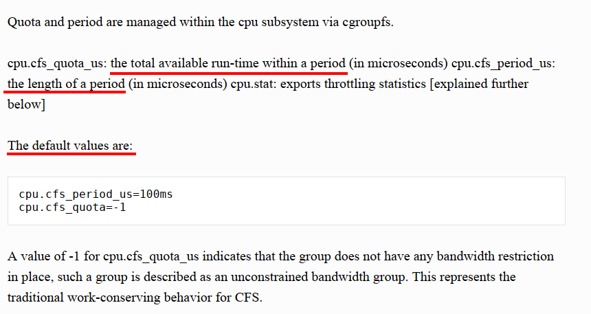

## examples

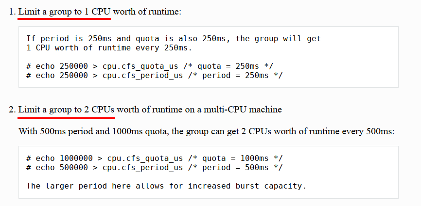

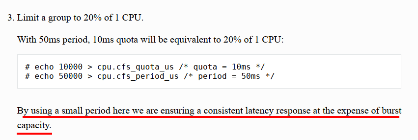


# taskset : Read the CPU Affinity of a Running Process

## Read the CPU Affinity of a Running Process

For example, to check the CPU affinity of a process with PID 1141.
```bash
$ taskset -cp 1141
pid 1141's current affinity list: 0-31
```

in above example, pid 1141 can be executed on CPU core 0-31.

## taskset example to run a process in particular core

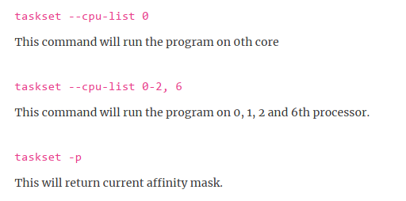


## taskset will not restrain other processess

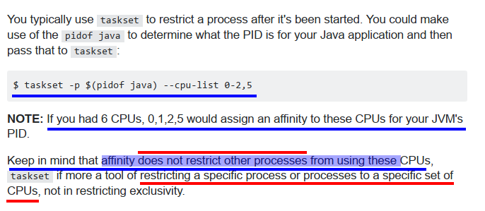
